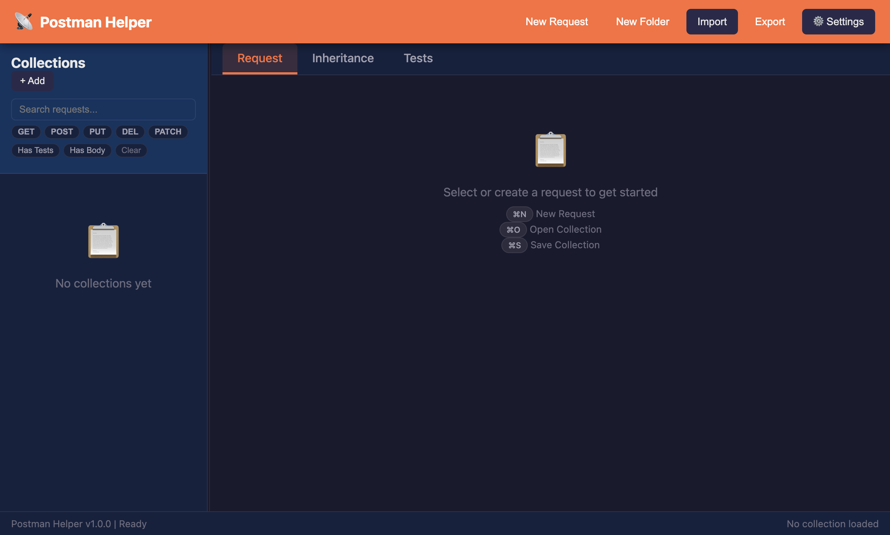
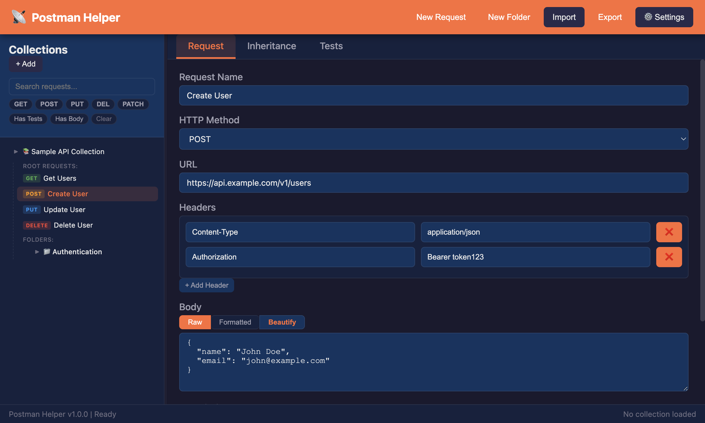
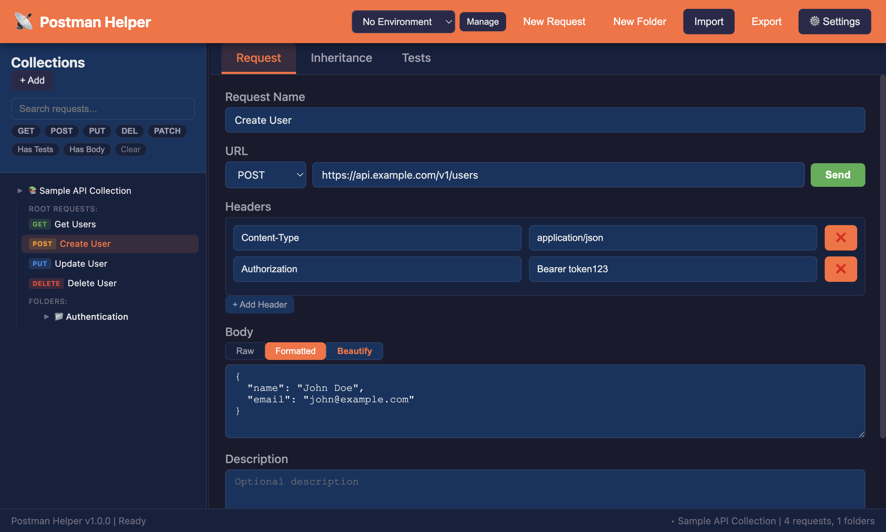
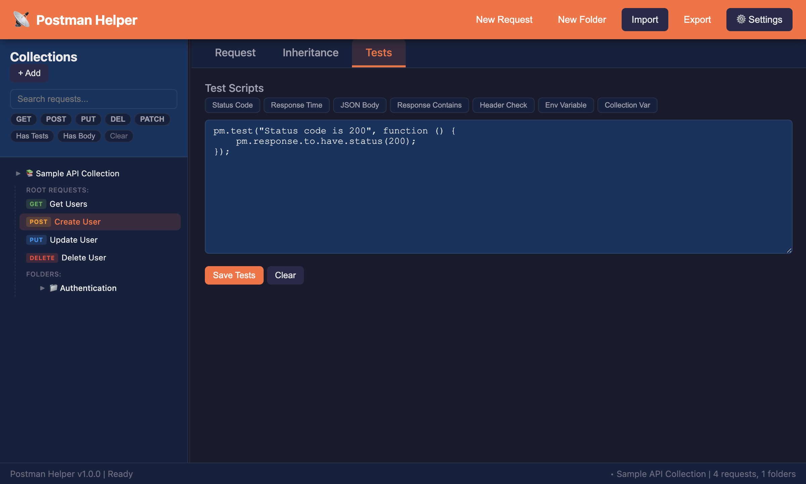
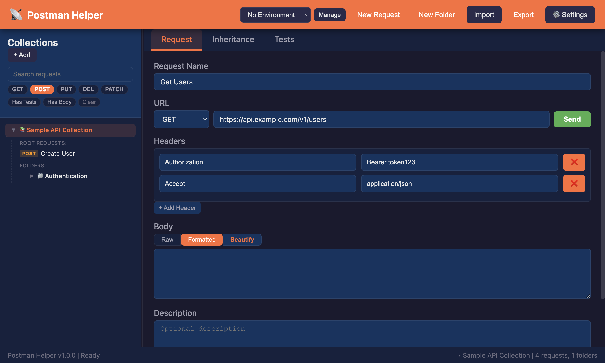
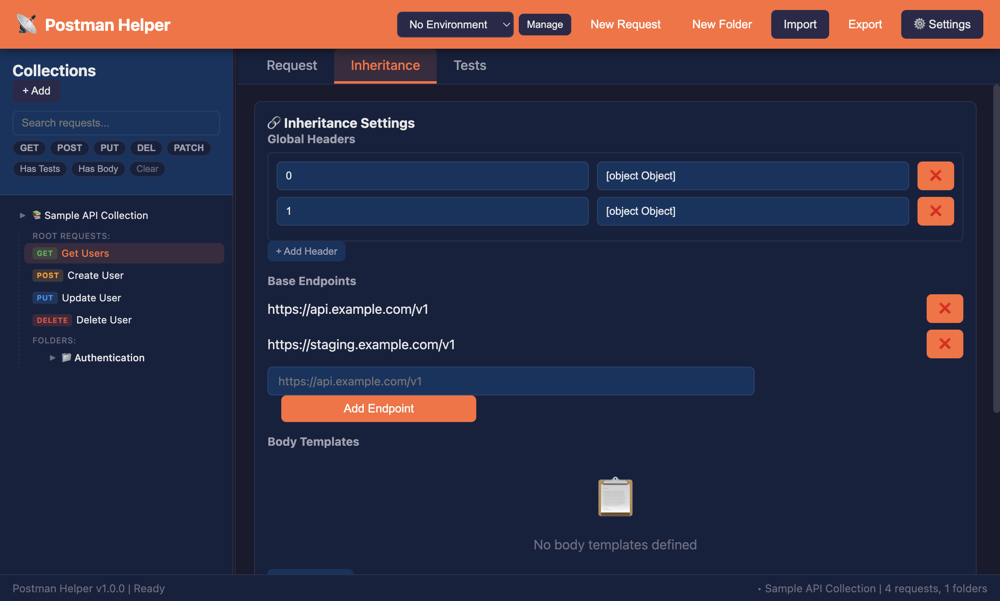

# Postman Helper

A desktop app for creating, managing, and exporting Postman API requests and collections. Built with Electron and vanilla JS.

## Screenshots

### Main Screen


### Request Editor


### JSON Body Beautify


### Test Script Editor


### Request Filtering


### Inheritance Settings


## Features

- **Request Execution** — Send HTTP requests directly from the app with a one-click Send button. Response panel shows status code (color-coded), response time, body (auto-formatted JSON), and headers
- **Environment Variables** — Create and manage multiple environments (dev, staging, prod) with key-value variables. Use `{{variable}}` syntax in URLs, headers, and body with live URL preview showing resolved values
- **Context Menus** — Right-click any tree item for quick actions: Rename, Duplicate, Move to Folder, Delete for requests; Rename, Add Request, Add Subfolder, Delete for folders
- **Auto-save & Persistence** — Work is automatically saved to `~/.postman-helper/autosave.json` with 2-second debounce. On startup, offers to restore your previous session including collection, environments, inheritance rules, and settings
- **Request Management** — Create, edit, duplicate, and delete API requests with full HTTP method support (GET, POST, PUT, DELETE, PATCH, HEAD, OPTIONS)
- **Collection & Folder Organization** — Group requests into collections and nested folders with a collapsible sidebar tree
- **Postman v2.1 Import/Export** — Full compatibility with Postman Collection format, including headers, body, and test scripts
- **Request Inheritance** — Global headers, base endpoints, body templates, and test templates that apply across requests. Inheritance is applied at send-time, not save-time
- **Body Editor with JSON Toggle** — Raw, Formatted, and Beautify modes for request body editing with inline validation
- **Request Filtering** — Search by name/URL, filter by HTTP method, and toggle "Has Tests" / "Has Body" filters
- **Resizable Sidebar** — Drag to resize between 200-500px, width persists across sessions
- **Test Script Editor** — Snippet buttons for common Postman test patterns and `pm.*` autocomplete with 34 API entries
- **Custom Dialog System** — Themed prompt and confirm dialogs replacing browser defaults
- **Drag & Drop** — Move requests and folders between collections
- **Dark/Light Theme** — Toggle via settings panel
- **Keyboard Shortcuts** — `Cmd+N` new request, `Cmd+O` import, `Cmd+S` export

## Getting Started

### Prerequisites

- Node.js 14+
- npm

### Install & Run

```bash
npm install
npm start
```

### Run Tests

```bash
npm test
```

155 tests covering models, app state, dialogs, import/export round-trips, UI structure, and IPC handlers.

### Build for macOS

```bash
npm run package
```

Outputs to `dist/`.

## Project Structure

```
main.js          — Electron main process, IPC handlers (file I/O, HTTP requests, auto-save)
preload.js       — Context bridge, exposes models + electronAPI to renderer
app.js           — Core renderer logic, fallback model classes, all app logic
models.js        — Data models: PostmanRequest, Collection, Folder, InheritanceManager
index.html       — UI structure with embedded CSS
tests/           — Node.js test suite (node:test + node:assert)
src/managers/    — Refactoring stubs (16 files)
src/ui/          — UI rendering stubs (11 files)
```

## Tech Stack

- **Electron 30.0.0** — Desktop shell
- **Vanilla JS** — No framework, CommonJS modules
- **HTML/CSS** — Single file with CSS custom properties for theming

## License

MIT
